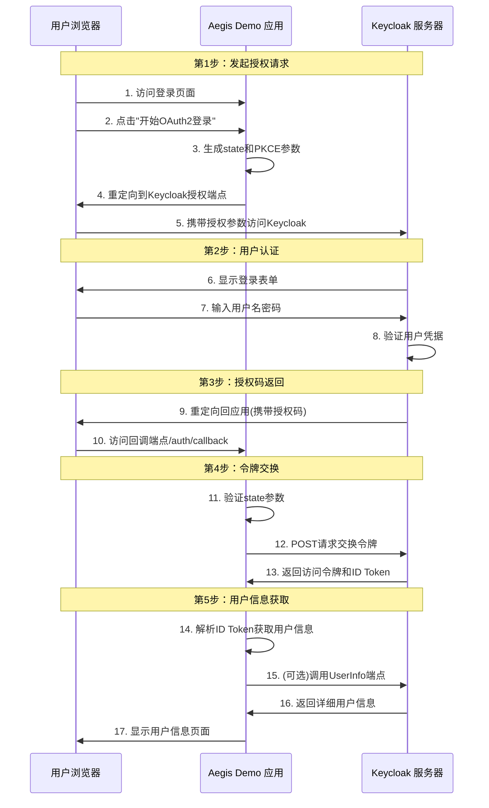

# Aegis Demo - 手动实现 OAuth2/OIDC 协议教学项目

这是一个**手动实现 OAuth2/OpenID Connect 协议**的 Keycloak 集成教学演示项目。

## 📚 项目目的

本项目的核心价值在于完全手动实现了 OAuth2 授权码流程，而非依赖 Spring Security OAuth2 Client 的自动配置（这有时被视为黑盒）。其主要目的是为开发人员接入 Keycloak 提供一个清晰、原始的流程示范。请注意：此流程本身是标准的 OAuth2 流程，因此也适用于任何符合 OAuth2 标准的场景。不过，对于使用有条件的项目，我们仍然强烈推荐直接使用 Spring Security OAuth2 Client，以获得更便捷快速的集成体验。
### 🎯 说明
- ✅ **完整流程展示**：从授权请求到令牌交换的每个步骤都有详细实现
- ✅ **代码透明性**：所有 OAuth2 相关代码都可以直接查看和理解
- ✅ **安全机制演示**：包含 PKCE、state 参数等安全措施的具体实现
- ✅ **详细注释说明**：每个关键步骤都有详细的中文注释
- ✅ **错误处理展示**：展示各种异常情况的处理方式

## 🔄 OAuth2 交互流程详解

### 流程图



### 详细交互步骤

#### 第1步：授权请求生成
```http
GET /realms/aegis-realm/protocol/openid-connect/auth?
    response_type=code&
    client_id=aegis-demo&
    redirect_uri=http://127.0.0.1:8282/auth/callback&
    scope=openid+profile+email&
    state=RANDOM_STATE_32_CHARS&
    code_challenge=BASE64URL_ENCODED_SHA256&
    code_challenge_method=S256
```

**关键安全参数：**
- `state`: 防CSRF攻击的随机参数
- `code_challenge`: PKCE挑战码，防授权码拦截
- `code_challenge_method`: S256，使用SHA256哈希

#### 第2步：授权码交换令牌
```http
POST /realms/aegis-realm/protocol/openid-connect/token
Content-Type: application/x-www-form-urlencoded

grant_type=authorization_code&
client_id=aegis-demo&
client_secret=CLIENT_SECRET&
code=AUTHORIZATION_CODE&
redirect_uri=http://127.0.0.1:8282/auth/callback&
code_verifier=ORIGINAL_CODE_VERIFIER
```

**响应示例：**
```json
{
  "access_token": "eyJhbGciOiJSUzI1NiIsInR5cCI6IkpXVCJ9...",
  "expires_in": 300,
  "refresh_expires_in": 1800,
  "refresh_token": "eyJhbGciOiJSUzI1NiIsInR5cCI6IkpXVCJ9...",
  "token_type": "Bearer",
  "id_token": "eyJhbGciOiJSUzI1NiIsInR5cCI6IkpXVCJ9...",
  "not-before-policy": 0,
  "session_state": "a1b2c3d4-e5f6-7890-abcd-ef1234567890"
}
```

#### 第3步：ID Token 解析
```javascript
// ID Token JWT 结构 (Header.Payload.Signature)
{
  "alg": "RS256",
  "typ": "JWT",
  "kid": "key-id"
}.
{
  "sub": "f:b2c3d4e5-f6g7-h8i9-j0k1-l2m3n4o5p6q7:testuser",
  "aud": "aegis-demo",
  "iss": "http://localhost:8090/realms/aegis-realm",
  "exp": 1703123456,
  "iat": 1703120000,
  "auth_time": 1703119950,
  "preferred_username": "testuser",
  "email": "test@example.com",
  "name": "Test User",
  "session_state": "a1b2c3d4-e5f6-7890-abcd-ef1234567890"
}.
[signature]
```

#### 第4步：单点登出流程
```http
GET /realms/aegis-realm/protocol/openid-connect/logout?
    id_token_hint=ID_TOKEN_VALUE&
    post_logout_redirect_uri=http://127.0.0.1:8282
```

## 🛠 技术栈

- **JDK 17** - 基础运行环境
- **Spring Boot 3.1.5** - 应用框架
- **Spring Security 6** - 基础安全配置（非 OAuth2 自动配置）
- **Spring WebFlux** - HTTP 客户端用于调用 Keycloak API
- **Thymeleaf** - 模板引擎
- **Bootstrap 5** - 前端UI框架
- **Jackson** - JSON 处理
- **Keycloak** - 身份提供者
- **Maven** - 构建工具

## 🏃‍♂️ 快速开始

### 1.  配置应用程序

编辑 `src/main/resources/application.yml`：

```yaml
# Keycloak 配置
keycloak:
  server:
    url: http://localhost:8090
  realm: aegis-realm
  client:
    id: aegis-demo
    secret: YOUR_CLIENT_SECRET_HERE  # 从 Keycloak Client Credentials 页面获取

# 应用程序配置
app:
  base:
    url: http://localhost:8282
```

### 2. 运行应用程序

```bash
# 编译和运行
mvn spring-boot:run

# 或者构建JAR包运行
mvn clean package
java -jar target/aegis-demo-1.0.0.jar
```

### 3. 测试登录流程

1. 访问 `http://127.0.0.1:8282`
2. 点击"开始 OAuth2 登录流程"
3. 使用 testuser/password123 登录
4. 验证用户信息页面和登出功能

## 🔧 项目结构

```
aegis-demo/
├── src/main/java/com/aegis/demo/
│   ├── AegisDemoApplication.java          # Spring Boot 主应用程序
│   ├── config/
│   │   ├── KeycloakConfig.java           # Keycloak 配置管理
│   │   └── SecurityConfig.java           # Spring Security 基础配置
│   ├── model/
│   │   └── UserInfo.java                 # 用户信息数据模型
│   ├── service/
│   │   └── OAuth2Service.java            # OAuth2 手动实现服务（核心）
│   ├── controller/
│   │   ├── HomeController.java           # 登录流程控制器
│   │   └── LogoutController.java         # Keycloak会话下线处理
├── src/main/resources/
│   ├── templates/
│   │   ├── index.html                    # 登录页面
│   │   ├── user.html                     # 用户信息页面
│   │   └── logout.html                   # 登出确认页面
│   ├── static/css/
│   │   └── style.css                     # 自定义样式
│   └── application.yml                   # 应用程序配置
└── pom.xml                               # Maven 依赖配置
```

### 核心实现文件

#### OAuth2Service.java - 核心逻辑
- `generateAuthorizationUrl()` - 生成授权请求 URL（含PKCE和state）
- `handleCallback()` - 处理授权回调和令牌交换
- `parseIdToken()` - 解析 JWT ID Token 获取用户信息
- `generateLogoutUrl()` - 生成单点登出 URL（含id_token_hint）

#### HomeController.java - 流程控制
- `GET /` - 首页：未登录显示登录页，已登录重定向到用户页
- `GET /login` - 发起授权请求，重定向到Keycloak
- `GET /auth/callback` - 处理授权回调，交换令牌
- `GET /user` - 显示用户信息和令牌详情
- `GET|POST /logout` - 登出确认页面和执行登出

## 🔐 安全特性实现

### PKCE (Proof Key for Code Exchange)
```java
// 生成 code_verifier (43-128字符的随机字符串)
String codeVerifier = generateRandomString(128);

// 生成 code_challenge (SHA256 hash + Base64 URL编码)
byte[] digest = MessageDigest.getInstance("SHA-256").digest(codeVerifier.getBytes());
String codeChallenge = Base64.getUrlEncoder().withoutPadding().encodeToString(digest);
```

### CSRF 防护 (State 参数)
```java
// 生成随机state参数
String state = generateRandomString(32);
stateStore.put(state, System.currentTimeMillis());

// 回调时验证state
if (!stateStore.containsKey(state)) {
    throw new RuntimeException("Invalid state parameter - possible CSRF attack");
}
```

### JWT 解析（简化实现）
```java
// 分解JWT三部分
String[] parts = idToken.split("\\.");
// 解码payload
String payload = new String(Base64.getUrlDecoder().decode(parts[1]));
// 解析用户声明
Map<String, Object> claims = objectMapper.readValue(payload, Map.class);
```

⚠️ **注意**：生产环境必须验证JWT签名！

## ⚡ 实现方式对比

| 特性 | 手动实现（本项目） | Spring OAuth2 Client |
|------|------------------|---------------------|
| **学习价值** | ⭐⭐⭐⭐⭐ 完全理解协议 | ⭐⭐ 理解配置 |
| **代码透明度** | ⭐⭐⭐⭐⭐ 每步可控 | ⭐⭐ 黑盒处理 |
| **开发时间** | 长 - 500+行代码 | 短 - 50行配置 |
| **生产可用性** | ⭐⭐ 需要完善安全 | ⭐⭐⭐⭐⭐ 开箱即用 |
| **维护成本** | ⭐⭐ 手动维护 | ⭐⭐⭐⭐⭐ 框架维护 |
| **定制灵活性** | ⭐⭐⭐⭐⭐ 完全可控 | ⭐⭐⭐ 配置范围内 |

### Spring OAuth2 Client 配置示例（生产推荐）

```yaml
spring:
  security:
    oauth2:
      client:
        registration:
          keycloak:
            client-id: aegis-demo
            client-secret: ${KEYCLOAK_CLIENT_SECRET}
            scope: openid,profile,email
            authorization-grant-type: authorization_code
            redirect-uri: "{baseUrl}/login/oauth2/code/{registrationId}"
        provider:
          keycloak:
            issuer-uri: https://keycloak-server/realms/realm-name
            user-name-attribute: preferred_username
```

```java
@Controller
public class HomeController {
    @GetMapping("/user")
    public String user(@AuthenticationPrincipal OidcUser principal, Model model) {
        model.addAttribute("username", principal.getPreferredUsername());
        model.addAttribute("email", principal.getEmail());
        return "user";
    }
}
```

## 🐛 常见问题

### 1. 重定向 URI 不匹配
**错误**：`invalid_request: Invalid redirect_uri`
**解决**：确保 Keycloak Client 配置中的 Valid redirect URIs 包含 `http://127.0.0.1:8282/auth/callback`

### 2. CORS 错误
**错误**：跨域请求被阻止
**解决**：在 Keycloak Client 设置 Web origins 为 `http://127.0.0.1:8282`

### 3. Client Secret 错误
**错误**：`invalid_client: Invalid client credentials`
**解决**：检查 application.yml 中的 client secret 是否与 Keycloak 一致

### 4. 端口冲突
**错误**：端口被占用
**解决**：修改 application.yml 中的 server.port，并更新 Keycloak 配置

### 5. 缺少 id_token_hint
**错误**：登出时提示缺少 id_token_hint 参数
**解决**：确保 UserInfo 对象包含原始 ID Token


## ⚠️ 重要说明

### 示例 vs 生产

**本项目主要用于演示目的**，帮助开发者理解 OAuth2/OIDC 协议原理。

**生产环境强烈推荐使用 Spring Security OAuth2 Client**，原因：
- ✅ 完整的 JWT 签名验证
- ✅ 自动令牌刷新和生命周期管理  
- ✅ 完善的错误处理和重试机制
- ✅ 符合安全最佳实践
- ✅ 活跃的社区支持和持续更新

### 项目限制
- 🔶 **简化实现**：跳过了 JWT 签名验证等安全检查
- 🔶 **内存会话**：未实现分布式会话管理
- 🔶 **错误处理**：相对简化的错误处理
- 🔶 **维护成本**：需要手动维护安全更新
